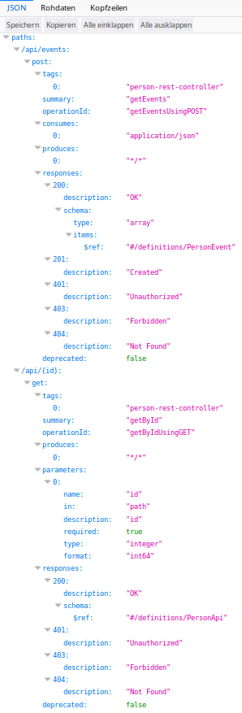

# Dokumentation für Projekt 4

## Aufbau des Projekts
Das Projekt haben wir entsprechend dem MVC pattern aufgebaut. Der Code ist somit
in 4 Unterverzeichnisen: Controller, Model und Resources und Service. Wir haben
das "Person-scs" implementiert.

## Funktionsweise des Programms
Das Program bietet durch eine Benutzeroberfläche die Möglichkeit neue Personen
anzulegen. Diese werden in einer SQL Datenbank gespeichert. In der Datenbank werden
mehrere Informationen über eine Person gespeichert, unter anderem an welchen Projekten
diese Person in der Vergangenheit beteiligt war. Um diese Funktionalität zu
ermöglichen muss unser SCS mit dem Projekt-SCS Daten austauschen können. Wir verwenden
dafür RestApi und einen RestController.

### Funktionsweise des Controllers
Der Controller verarbeitet verschiedene Anfragen: so werden hier
Daten die von den Views kommen mit hilfe von Services bearbeitet und gespeichert/aktualisiert.
Hier werden auch Daten aus der Dankenbank gehollt und an Views zum anzeigen
weitergegeben. Immer wenn die Startseite/person aufgerufen wird, aktualisiert
der Controller durch das Service "UpdateProjekteService" den Stand der Projekte.

### Funktionsweise des RestControllers
Das Mapping für den RestController ist person/api/. Danach bieten
wir zwei Funktionalitäten: /id und /events. Mit /id wird ein PersonApi als Json
zurückgegeben. PersonApi ist ein Objekt das aus einem Person Objekt gebaut wird, mit dem
Unterschied das es keinen Feld "jahreslohn" enthält (da SCS keine finanziellen Daten
unter einander austauschen dürfen). +
Mit /events werden alle PersonEvents (d.h. alle Änderungen in der Personen) züruckgegeben.
Das andere SCS kann somit abfragen welche Personen geändert wurden und mit RestApi /id
diese Personen aktualisieren. Sobald Änderungen abgefragt wurde, werden diese Events (Änderungen) aus
der Datenbank gelöscht.

### Repositories
In unserem Programm haben wir 3 Repositories: eins für Personen, eins für Projekte und
eins für PersonEvents. 2 sind auf jeden Fall notwendig, da unsere SCS auch ohne der Projekt-SCS laufen muss.
Wir haben uns auch entschieden, dass wir PersonEvents in der Datenbank speichern, da so
Änderungen auch bei einem Ausfall des Systems erhalten bleiben, bis der andere SCS sie abgefragt hat.

### Services
Da wir ursprünglich sehr viel Code im Controller hatten, haben wir uns
entschieden dafür Services zu schreiben um im Controller keine Geschäftslogik zu
haben.

## Test

- Wir haben versucht, alle Methode in Controller zu testen (80% lines Coverage).
Um die url zu holen, müssen wir Mockmvc bzw. Mockito benutzen, danach vergleichen wir mit dem Fake
Ergebnis. Dazu brauchen wir einigen Contruktoren bei Controller, um die Repositories zu implementierten.
In jedem Test wird die status(), Model view, die Parameter in Model als auch wie viel mal die Repositories
aufgerufen wurde.

- Trotzdem versuchen wir noch,das Package Service zu testen. Weil wir nicht den private Method "getEntity()"
mocken zu können.

### Swagger API
Um die Api zu dokumentieren haben wir (so wie in der Übung) Swagger und die Klasse
SwaggerConfig benutzt. Unsere Api ist: +

## Probleme die wir lösen mussten
Das erste Problem das wir lösen mussten war, dass das vorgegebene docker-compose nicht ohne
beider SCS funktionerte. Wir haben dieses Problem gelöst indem wir ein dummy SCS implementierten.
Das hatte auch den Vorteil, dass wir unser SCS auch auf andere Funktionen direkt testen konnten, ohne
auf ein anderes Team warten zu müssen. +
Ein weiteres Problem war das Starten von docker-compose. Hier starten verschiedene
container unterschiedlich schnell und das kann zu Problemen führen. Wir haben zuerst so gearbeitet,
dass wir zuerst das Befehl "docker-compose up -d" ausgeführt haben und erst nach 2-3 Minuten
"docker-compose up." Das hat gut funktioniert. Allerdings ist die Wartezeit bei dieser Methode nicht
genau vorhersagbar. Aus diesem Grund haben wir uns entschieden file "wait_for_it.sh" zu benutzen und finden
diese Lösung besser. Allerdings hat auch "wait_for_it.sh" ein Problem - es funktioniert erst wenn
man docker-compose zum zweiten Mal startet. +
Wir haben bei der Entwicklung der App ein paar Tricks benutzt: so haben wir in der Entwicklung nicht
das abgegebene Dockerfile benutzt, sondern eine einfachere Version, wo das ständige Downloaden von gradle nicht
nötig war. Das hat viel Zeit gespart. Abgegeben haben wir trotzdem die standard Version (wie in der Übung), da
sie übersichtlicher ist. +
Zum entwickeln haben wir wie in der Übung vorgestellt eine application-dev.properties geschrieben.
Diese hat uns ermöglicht unser Programm direkt aus der IDE aus zu testen und hat das Entwicklungprocess erleichtert.
